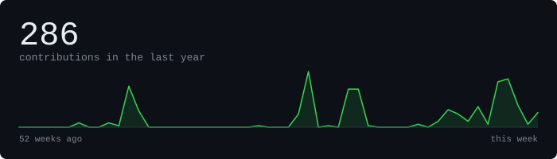
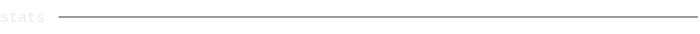
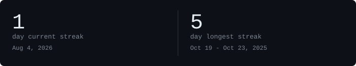
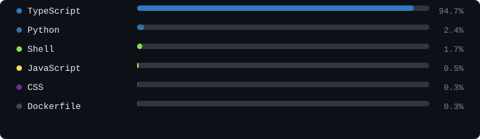

[linkedin](https://www.linkedin.com/in/mirza-mohammad-abbas/) &nbsp;·&nbsp;
[email](mailto:mirzamohammad92110@gmail.com) &nbsp;·&nbsp;
[discord](https://discord.com/users/460715720473575435)

> CS student at VIT Vellore, India. 
> Small, sharp tools over big vague ideas.

I'm Mirza Mohammad Abbas. I build full-stack projects and like figuring out 
how things work under the hood — more about me coming soon.

<samp>python &nbsp; java &nbsp; c++ &nbsp; c &nbsp; javascript &nbsp; typescript &nbsp; react &nbsp; next.js &nbsp; node.js &nbsp; express &nbsp; tailwind css &nbsp; docker &nbsp; postgresql &nbsp; mongodb &nbsp; redis</samp>

**[scribblitz](https://github.com/mirza-mohammad24/scribblitz)** 
placeholder description — coming soon.

**[Algo-Vis](https://github.com/mirza-mohammad24/Algo-Vis)** 
placeholder description — coming soon.

**[life-wallpaper](https://github.com/mirza-mohammad24/life-wallpaper)** 
placeholder description — coming soon.

